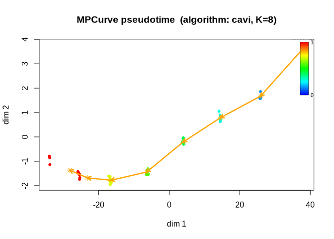
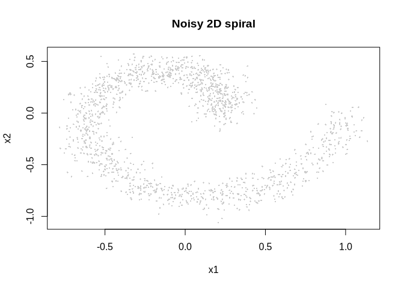
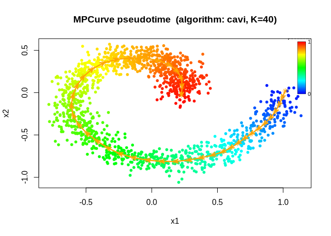
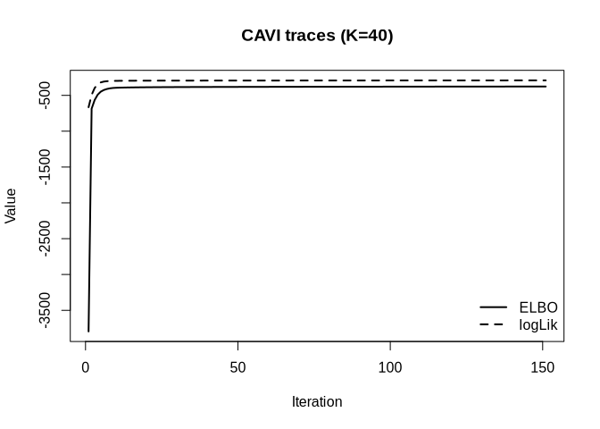

<!-- README.md is generated from README.Rmd. Please edit that file -->

# MPCurver

<!-- badges: start -->
<!-- badges: end -->

`MPCurver` estimates latent sample orderings and smooth feature
trajectories from multivariate data. It represents an ordering by a grid
of positions and models each feature as a smooth function along that
grid. Gaussian measurement models and random-walk priors allow it to
estimate trajectories together with their uncertainty.

For data with several sources of variation, MPCurver can learn multiple
orderings and the probability that each feature follows each ordering.
This allows different groups of features to describe different patterns
among the same samples.

Use `fit_mpcurve()` to fit a model, `summary()` and `plot()` to explore
the results, and `do_mpcurve()` to run additional fitting iterations.

## Documentation

- [Getting
  started](https://aguerozz.github.io/MPCurver/articles/mpcurve_intro.html):
  the single-ordering model and a simulated trajectory example.

- [Multiple
  orderings](https://aguerozz.github.io/MPCurver/articles/partition.html):
  the multi-ordering model and an example fit.

- [Estimating intrinsic
  dimension](https://aguerozz.github.io/MPCurver/articles/intrinsic_dimension.html):
  automatic initialization, adaptive feature support, and dimension
  selection.

- [Fitness data
  analysis](https://aguerozz.github.io/MPCurver/articles/fitness.html):
  a worked example with smoothing and measurement uncertainty.

- Optional algorithm details: [Single-ordering
  CAVI](https://aguerozz.github.io/MPCurver/articles/cavi_single.html)
  and [Multi-ordering
  CAVI](https://aguerozz.github.io/MPCurver/articles/cavi_partition.html).

## Installation

Install `MPCurver` from GitHub:

``` r
pak::pak("AgueroZZ/MPCurver")
```

## Quick start

``` r
library(MPCurver)
sim_small <- simulate_mpcurve(n = 60, d = 6, num_bins = 8, seed = 1)
fit_small <- fit_mpcurve(sim_small$X, num_bins = 8)
summary(fit_small)
#> MPCurve Model Summary
#> Algorithm : cavi  |  Model : homoskedastic  |  n=60  d=6  K=8
#> Position prior : adaptive
#> Current pi range : [2.805e-12, 0.2167]
#> Converged : yes
#> Underlying fit summary
#> <summary.cavi>
#>   n = 60, d = 6, K = 8
#>   model = homoskedastic, RW(q) = 2
#>   noise model = estimated_feature_variance
#>   init = PCA, discretization = quantile, adaptive = variational
#>   position prior = adaptive
#>   iter = 7, converged = yes
#>   last ELBO = -345.99997 (delta last = 0.0003201)
#>   last logLik = -274.93912 (delta last = 0.007702)
#>   pi range = [2.805e-12, 0.2167]
#>   sigma2 range = [0.02148, 2.748]
#>   lambda range = [0.2428, 3.099]
#>   relative change (last step):
#>     ELBO: 9.25e-07
#>     logLik: 2.8e-05
#>     lambda_vec (L2 rel): 0.00396
positions <- fitted_positions(fit_small)                 # samples x orderings
trajectories <- fitted_trajectories(fit_small)            # features x bins x orderings
assignment_probabilities <- fitted_assignments(fit_small) # features x orderings
```

Figure 1 shows the inferred ordering and trajectory. Inspect
`summary(fit_small)` and the objective trace when assessing convergence;
use `do_mpcurve(fit_small, max_iter = 100)` to continue a fit.

``` r
plot(fit_small)
```

<div class="figure">


<p class="caption">
Figure 1. Sample observations colored by posterior-mean pseudotime, with
the fitted mean trajectory in orange.
</p>

</div>

The extraction functions retain the ordering dimension even for one
ordering. Use `fitted_positions(fit_small, "sd")` or
`fitted_trajectories(fit_small, "sd")` for posterior standard
deviations.

### Your data

Supply a numeric matrix or all-numeric data frame, with samples in rows
and features in columns. Sample and feature names are retained;
`plot(fit, dims = "gene_name")` selects a named feature. Values must be
finite: handle missing values before fitting. MPCurver does not impute
or standardize the fitting data. Optional measurement SDs `S` must be
finite and nonnegative, in the same units and positional order as `X`,
as a feature vector or a matrix matching `X`. Names do not trigger
reordering. See `?fit_mpcurve` for details.

## Worked spiral example

The example below recovers a latent ordering from a noisy
two-dimensional spiral.

``` r
library(MPCurver)
```

Generate the observations shown in Figure 2:

``` r
sim <- simulate_spiral2d(n = 1500, turns = 1, noise_sd = 0.08, seed = 123)
plot(sim$obs, pch = 16, cex = 0.35, col = "grey80",
     xlab = "x1", ylab = "x2", main = "Noisy 2D spiral")
```

<div class="figure">


<p class="caption">
Figure 2. Noisy two-dimensional spiral observations.
</p>

</div>

Fit a model with 40 grid positions and a second-order random-walk prior.
The inferred ordering and trajectory appear in Figure 3; Figure 4 shows
the variational objective over fitting iterations.

``` r
set.seed(123)
fit <- fit_mpcurve(
    X = as.matrix(sim$obs),
    initial_method = "isomap",
    num_bins = 40,
    max_iter = 150,
    tol = 1e-8,
    control = mpcurve_control(rw_order = 2),
    init_control = mpcurve_init_control(discretization = "equal")
  )

plot(fit)
```

<div class="figure">


<p class="caption">
Figure 3. Inferred sample ordering and smooth trajectory for the noisy
spiral.
</p>

</div>

``` r
plot(fit, plot_type = "elbo")
```

<div class="figure">


<p class="caption">
Figure 4. Variational objective over fitting iterations for the spiral
model.
</p>

</div>

Initialization can affect the fitted ordering, especially for curved or
weakly separated patterns. Here we compare three starting orderings
under the same model and fitting settings:

``` r
init_methods <- c("PCA", "fiedler", "isomap")
fits <- setNames(
  lapply(init_methods, function(init_method) {
    fit_mpcurve(
    X = as.matrix(sim$obs),
    initial_method = init_method,
    num_bins = 40,
    max_iter = 150,
    tol = 1e-8,
    control = mpcurve_control(rw_order = 2),
    init_control = mpcurve_init_control(discretization = "equal")
  )
  }),
  init_methods
)

data.frame(
  method = names(fits),
  elbo_last = unname(vapply(fits, function(x) tail(x$elbo_trace, 1), numeric(1)))
)
#>    method elbo_last
#> 1     PCA -424.1734
#> 2 fiedler -375.5500
#> 3  isomap -376.5416
```

For these fits with the same model and data, a larger final ELBO
indicates a better variational objective. Inspect the fitted
trajectories as well as this numerical comparison. Sample positions are
available in `fitted_positions(fit)`, and `fitted_trajectories(fit)`
contains the estimated feature trajectories.

Model settings are collected in `mpcurve_control()`. The default RW2
prior uses empirical-Bayes smoothness updates. For RW3 with precision
fixed at 5:

``` r
fit_rw3_fixed <- fit_mpcurve(
  X = as.matrix(sim$obs),
  initial_method = "isomap",
  control = mpcurve_control(rw_order = 3, lambda_init = 5, fix_lambda = TRUE)
)
```

Use `lambda_bounds` and `sigma2_bounds` in the same constructor to set
parameter limits. `mpcurve_init_control()` configures feature grouping
and ordering-helper arguments. Isomap defaults to `k_min`, the smallest
neighbor count connecting all samples in its undirected graph, computed
separately within each feature group. Its realized count is stored as
`k_used` in the initialization metadata. For a fixed count, use
`method_args = list(num_neighbors = 10)` when
`initial_method = "isomap"`.

Invalid initialization settings raise an error. If the requested
ordering computation fails, fitting warns with the cause and retries
using PCA component 1. Use
`init_control = mpcurve_init_control(on_failure = "error")` to stop
instead. If PCA fails, fitting stops; the initialization metadata
records any successful fallback and its original cause.

Continue a fit with `do_mpcurve(fit, max_iter = 100)`. It inherits the
stored model and measurement errors. To change precision while
continuing, use
`control = mpcurve_continue_control(lambda_init = 5, fix_lambda = TRUE)`;
`fix_lambda = FALSE` enables empirical-Bayes updates again. Omitted
continuation settings inherit their fitted values.

Ordering helpers keep method-specific advanced settings in a named
`control` list. When fitting, nest this list inside `method_args`, for
example
`mpcurve_init_control(method_args = list(num_neighbors = 10, control = list(num_landmarks = 100)))`
for Isomap. Reference pages list all accepted settings and defaults.
Simulation helpers consistently use `n` for samples, `d` or
block-specific counts for features, and `noise_sd` for Gaussian noise
standard deviations; trajectory-shape settings use their own `control`.

## Multiple orderings and feature groups

When the number of orderings is unknown, start with
`fit_mpcurve(X, intrinsic_dim = "auto")` using the default adaptive
partition prior. It is computationally simpler than candidate model
comparison: it fits one adaptively weighted model after similarity
initialization, then removes orderings with numerical-zero estimated
prior weights.

A single ordering may describe some features well while missing the
patterns in others. Set `intrinsic_dim = M` to fit $M$ orderings of the
same samples. MPCurver jointly estimates those orderings, smooth
trajectories, and a probability distribution over orderings for each
feature. For example, two groups of genes may vary along different
cell-state axes.

Inference uses structural variational inference: a feature’s trajectory
distribution is conditional on its ordering assignment. This preserves
the dependence between which ordering a feature follows and the shape of
its trajectory. Each feature has one noise variance shared across the
candidate orderings, while smoothness can vary with the feature and
ordering.

The default similarity initialization clusters the features, then
applies one ordering method independently within every feature group.
PCA is the default, using each group’s own PC1. Setting
`initial_method = "isomap"` or `initial_method = "fiedler"` applies that
method separately to all groups.

For a two-ordering analysis of your sample-by-feature data matrix `X`:

``` r
fit_multi <- fit_mpcurve(
    X,
    intrinsic_dim = 2,
    num_bins = 40
  )
summary(fit_multi)
fitted_assignments(fit_multi)
fit_multi$intrinsic_dim
plot(fit_multi, plot_type = "mu", dims = 1)
```

When the number of orderings is unknown, `intrinsic_dim = "auto"` can
choose an initialization dimension from the feature-similarity tree
before fitting the adaptive model:

``` r
fit_auto <- fit_mpcurve(
    X,
    intrinsic_dim = "auto",
    num_bins = 40,
    init_control = mpcurve_init_control(max_intrinsic_dim = 8, min_cluster_size = 2)
  )

fit_auto$dimension_initialization$diagnostics
fit_auto$intrinsic_dim
```

Automatic initialization uses the fast spline-R-squared metric
(`similarity_metric = "spline_r2"`) by default, with five spline degrees
of freedom. It selects the eligible cut with the largest mean
silhouette, where every cluster must contain at least
`init_control$min_cluster_size` features (default 2). For adaptive
fitting, the selected cluster-size proportions initialize the global
ordering probabilities; subsequent empirical-Bayes updates can leave
some orderings with estimated prior weights numerically close to zero.
Automatic fitting removes those orderings without additional fitting and
returns a model with the estimated dimension. Initial and final
dimensions and any removed orderings are recorded in
`fit_auto$dimension_estimation`.

The assignment probabilities describe how strongly each feature supports
each ordering. The trajectory plot shows the feature’s fitted mean under
each ordering, with the corresponding assignment probability in the
panel title. `intrinsic_dim` is the actual number of orderings in the
returned model. An integer supplied by the user retains that dimension.
Automatic adaptive fitting removes orderings whose estimated prior
weights are at or below `control$effective_count_tol / P`, where $P$ is
the number of feature columns and the tolerance defaults to `1e-8`. This
tolerance identifies numerical zeros; values above `1e-6` trigger a
warning during automatic adaptive pruning because they may remove
supported orderings. For a fixed uniform assignment prior, use
`select_mpcurve_dimension(   X,   max_intrinsic_dim = 4,     direction = "forward"   )`
to compare final objectives across adjacent dimensions. This fits
multiple candidate models under a different prior and may choose a
different dimension from adaptive fitting. Inspect its saved scores and
convergence diagnostics alongside the feature groups. The
[multiple-ordering
tutorial](https://aguerozz.github.io/MPCurver/articles/partition.html)
introduces the statistical model. The [intrinsic-dimension
tutorial](https://aguerozz.github.io/MPCurver/articles/intrinsic_dimension.html)
explains estimation and dimension selection.

## Measurement uncertainty

By default, MPCurver estimates a noise variance for each feature. When
measurement standard deviations are available, supply them through `S`
as either a vector of feature-specific values or a matrix matching `X`.
The likelihood then accounts for the supplied precision of each
measurement. See the [fitness case
study](https://aguerozz.github.io/MPCurver/articles/fitness.html) for an
example.
